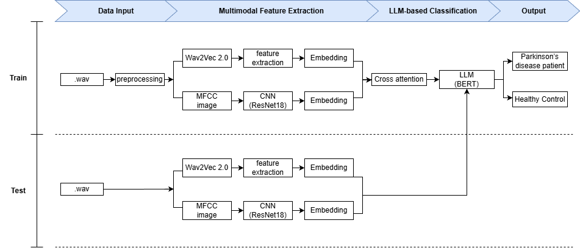

# 프로젝트 구조
```
pdhc_project/
├── data/
│ ├── vowel_data_preprocessed/             # 학습용 데이터 (지속모음 /pa/, /ta/ 포함)
│ ├── vowel_data_preprocessed_img/         # 학습용 데이터 (MFCC 시각화)
│ ├── italian_voice_pdhc_split_img/        # 외부 테스트용 데이터 (MFCC 시각화)
│ └── italian_voice_pdhc_split/            # 외부 테스트용 데이터
│
├── model/
│ ├── modules/
| |    ├── __init__.py                     # 모듈 초기화 파일
| |    ├── dataset_utils.py                # 데이터셋 로드 및 전처리 유틸 함수 정의 (오디오 및 MFCC 이미지 경로 수집)
| |    ├── embedding_utils.py              # 오디오(Wav2Vec2), 이미지(CNN) 임베딩 추출 함수 정의
| |    ├── eval_utils.py                   # 모델 평가 및 시각화 함수 정의 (Acc, AUC, Confusion Matrix, ROC Curve 계산 및 출력)
| |    ├── fusion_model.py                 # 멀티모달 융합 및 LLM 기반 분류기 모델 정의
| |    └── train_util.py                   # 모델 학습 및 검증 루프 관련 유틸 함수 정의
| | 
│ ├── wav2vec2_finetuning.ipynb            # Wav2Vec2 파인튜닝 코드
│ ├── main_pipline.ipynb                   # 멀티모달 LLM 최종 실행 코드 
│ └── wav2vec2_finetuning_model/
│      └── checkpoint-1690                 # Wav2Vec2 파인튜닝 결과 가중치
│
├── preprocess/
│ └── voice2mfcc_visual.ipynb              # MFCC 시각화 코드
│ └── preprocess_audio.py                  # 오디오 전처리 코드
│
├── requirements.txt                       # 실행 환경
├── README.md                              # 프로젝트 설명 문서
└── model_architecture.png                 # 모델 아키텍쳐 이미지

```
---

# 최종 아키텍처


---


# 설치 및 실행

### 1. 가상환경 설정

- Python 버전: 3.10

``` bash
conda create -n [가상환경이름] python=3.10
conda activate [가상환경이름]
```

### 2. 의존성 설치

- cuda 버전 : 12.1

``` bash
pip install -r requirements.txt --extra-index-url https://download.pytorch.org/whl/cu121
```

### 3. 전체 아키텍처 코드 실행

##### 3.1) 파인튜닝 모델 설정

- wav2vec2 모델을 자음,모음 등으로 파인튜닝한 모델이 다음과 같이 경로에 있어야함.
- 파인튜닝 모델 다운로드 경로 : https://drive.google.com/drive/folders/1TfjRR6vzSN3uzzkdU9UoFFAphgj5oz3y?usp=drive_link

├── model/
│ ├── modules/
│ ├── wav2vec2_finetuning.ipynb            # Wav2Vec2 파인튜닝 코드
│ ├── main_pipline.ipynb                   # 멀티모달 LLM 최종 실행 코드 
│ └── wav2vec2_finetuning_model/
│      └── checkpoint-1690                 # Wav2Vec2 파인튜닝 결과 가중치


##### 3.2) 데이터셋 설정

- 학습용 데이터와 테스트용 데이터가 다음과 같이 경로에 있어야함.
- 데이터셋 다운로드 경로 :  https://drive.google.com/drive/folders/1TfjRR6vzSN3uzzkdU9UoFFAphgj5oz3y?usp=drive_link

├── data/
│ ├── vowel_data_preprocessed/             # 학습용 데이터 (지속모음 /pa/, /ta/ 포함)
│ ├── vowel_data_preprocessed_img/         # 학습용 데이터 (MFCC 시각화)
│ ├── italian_voice_pdhc_split_img/        # 외부 테스트용 데이터 (MFCC 시각화)
│ └── italian_voice_pdhc_split/            # 외부 테스트용 데이터


##### 3.3) 코드 실행

``` bash

cd model 
python main_pipeline.py

```

또는 가상환경의 파이썬 직접 지정 후 실행

``` bash
 & "C:\Users\user\anaconda3\envs\test22\python.exe" "C:\hyunju\pdhc_project\model\main_pipeline.py"


```
